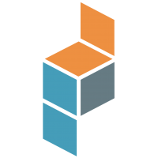

# Andrew Charles

<h4>
Hi! Thanks for giving me attention.  
I am a Full Stack developer with 7+ years of experience who is hands-on about solving problems and building products that are easy to deploy, simple to use, solve customer pain points, quick learning new concepts and technologies, and have an enterprise scale with a proven ability to deliver cutting edge enterprise products and solutions with strong multi skills. Specialized in building 20+ usable, useful, well-constructed websites and applications using Python, PHP, Javascript. Great experience in developing several fields such as Sports, Healthcare, B2B, B2C, Fintech, E-Commerce and so on. Developed the Hiring Meeting & Conference Website for graduates with zoom script, Token Swapping Sites, E-Learning Website for Children, Food Delivery and Ride Ordering Service Websites, Air-Conditioning Company Site, NFT marketplace Websites, NFT landing pages for minting and staking and so on.
</h4>

# Contact with me 👋

  
  
  

# Tech Stack 🤹‍♂️

## Languages

## Frameworks (Backend)

## Frameworks (Frontend)

## Frameworks (CSS)

## Databases

## DevOps

## Code Testing & Review

## Data Science

## Others

